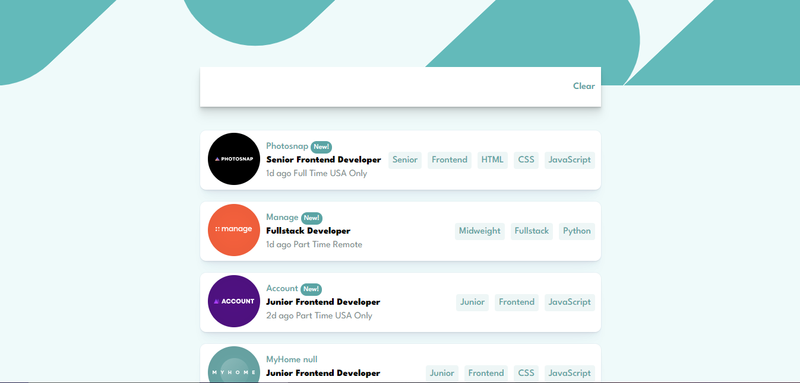

# Job listings with filtering solution

This is a solution to the [Job listings with filtering challenge on Frontend Mentor](https://www.frontendmentor.io/challenges/job-listings-with-filtering-ivstIPCt). Frontend Mentor challenges help you improve your coding skills by building realistic projects. 

## Table of contents

- [Overview](#overview)
  - [The challenge](#the-challenge)
  - [Screenshot](#screenshot)
  - [Links](#links)
- [My process](#my-process)
  - [Built with](#built-with)
  - [What I learned](#what-i-learned)
  - [Continued development](#continued-development)
- [Author](#author)

## Overview

### The challenge

Users should be able to:

- View the optimal layout for the site depending on their device's screen size
- See hover states for all interactive elements on the page
- Filter job listings based on the categories

### Screenshot

### Links

- Solution URL: [Github repo](https://github.com/Samiuddinkhan07/static-job-listings-master)
- Live Site URL: [Live Url](https://jobpedia.netlify.app/)

## My process

The approached i followed was to focus on the rendering the list first then rending the same list again while the user is searching for a specific role,after that my focus was to add the search tag and remove those tags with that i also leaned more mobile first approach so that i can minimize the working time on my media quries

### Built with

- Semantic HTML5 markup
- CSS custom properties
- Flexbox
- Mobile-first workflow
- SCSS

### What I learned

Building this project has taught me many new things, such as event delegation, and has fine-tuned my skills in filtering lists, removing items from arrays, and manipulating arrays. Additionally, I have learned how to craft pixel-perfect details.

### Continued development

For my future projects i really wanna focus on multi-step form and caching the data in case the user closes the website,the technique i really wanna work on is DRY and keep the code clean.

## Author

- Website - [Samiuddin khan](https://www.your-site.com)
<!-- - Frontend Mentor - [@yourusername](https://www.frontendmentor.io/profile/yourusername) -->
<!-- - Twitter - [@yourusername](https://www.twitter.com/yourusername) -->

